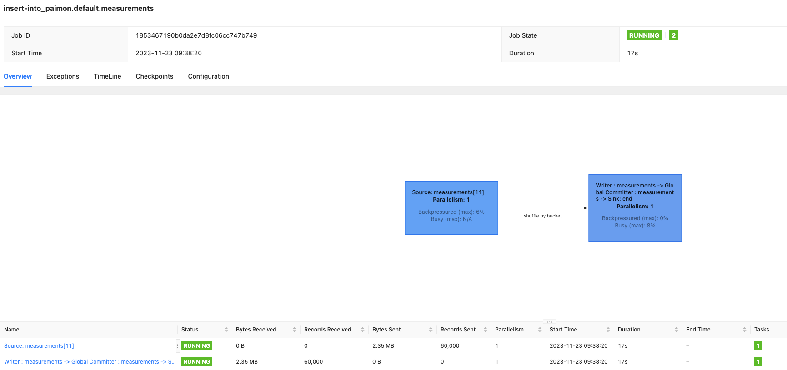
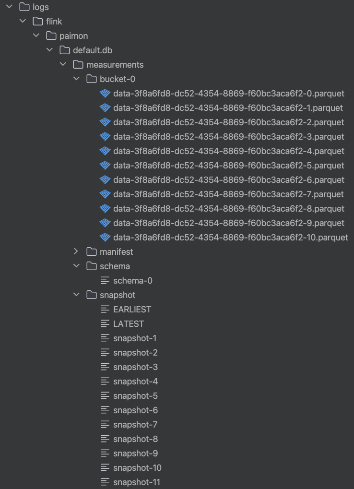
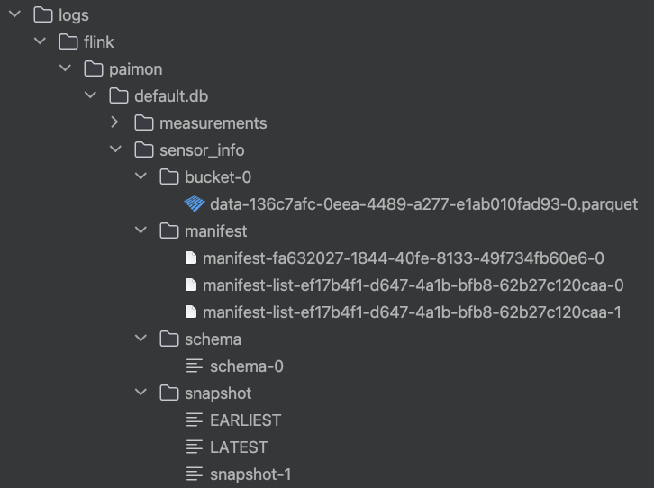
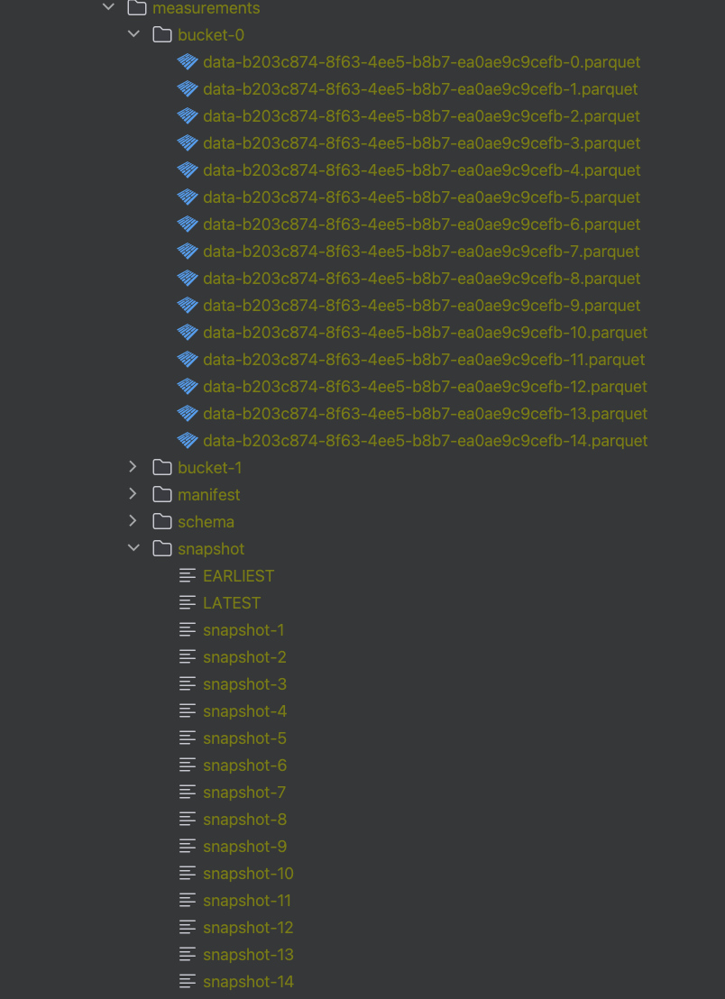
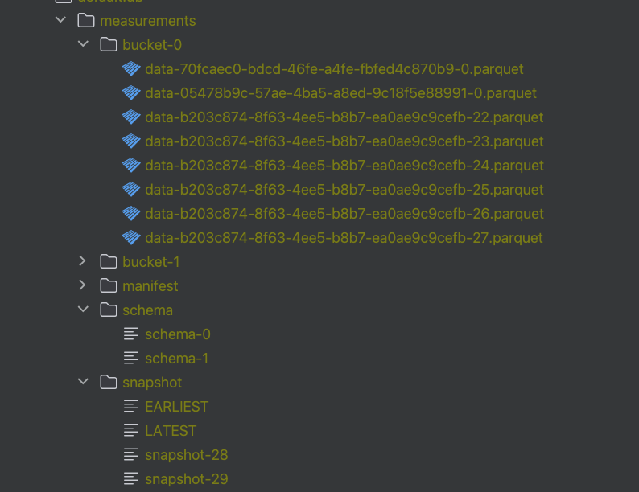

#### 1. Specify the following configuration options
```shell
SET 'parallelism.default' = '2';
SET 'execution.checkpointing.interval' = '20 s';
SET 'table.exec.sink.upsert-materialize' = 'NONE';
```

#### 2. Create a Paimon Catalog.

Compared to the `InMemory Catalog` the `Paimon Catalog` is persistent and accessible between different Flink SQL Sessions. 
```sql
CREATE CATALOG paimon WITH (
    'type'='paimon',
    'warehouse'='file:/opt/flink/temp/paimon'
);

USE CATALOG paimon;
```

### Part 1: Data Ingestion

#### 3. Create a new `measurements` table, but this time it will be backed by the paimon connector under the **Paimon Catalog**.
```sql
CREATE TABLE measurements (
    sensor_id BIGINT,
    reading DECIMAL(5, 1),
    event_time AS PROCTIME()
) WITH (
    'bucket' = '2',
    'bucket-key'='sensor_id',
    'file.format'='parquet'
);
```

#### Now let's insert some data into the `paimon-measurements` table
```sql
SET 'pipeline.name' = 'Measurements Ingestion';

INSERT INTO measurements
SELECT * FROM `default_catalog`.`default_database`.measurements;
```
<p align="center">
    
</p>


<p align="center">
    
</p>

```shell
SET 'execution.runtime-mode' = 'batch';

SELECT COUNT(*) FROM measurements;

SET 'execution.runtime-mode' = 'streaming';
```

```sql
CREATE TABLE sensor_info (
    sensor_id BIGINT,
    latitude DOUBLE PRECISION,
    longitude DOUBLE PRECISION,
    generation INT,
    updated_at TIMESTAMP(3),
    PRIMARY KEY (sensor_id) NOT ENFORCED
) WITH (
    'bucket'='1',
    'file.format'='parquet',
    -- Set changelog-producer as 'input'，
    -- this will inform the CDC source not to drop update_before, 
    -- and the downstream pipelines which consume measurements 
    -- as a source will not generate changelog-normalize operator
    'changelog-producer' = 'input' 
);
```

```sql
SET 'pipeline.name' = 'Sensor Info Ingestion';
INSERT INTO sensor_info
SELECT * FROM `default_catalog`.`default_database`.sensor_info;
```

<p align="center">
    
</p>

```shell
SET 'execution.runtime-mode' = 'batch';

Flink SQL> SELECT COUNT(*) AS total_sensor_information FROM sensor_info;
+--------------------------+
| total_sensor_information |
+--------------------------+
|                      100 |
+--------------------------+
1 row in set

SET 'execution.runtime-mode' = 'streaming';
```

### Part 2: Data Enrichment
```sql
CREATE TABLE measurements_enriched (
    sensor_id BIGINT,
    reading DECIMAL(5, 1),
    event_time TIMESTAMP(3),
    latitude DOUBLE PRECISION,
    longitude DOUBLE PRECISION,
    generation INT,
    updated_at TIMESTAMP(3)
) WITH (
      'bucket' = '1',
      'bucket-key' = 'sensor_id',
      'file.format' = 'parquet'
);
```

```sql
SET 'pipeline.name' = 'Data Enrichment with Lookup Join';
    
INSERT INTO measurements_enriched
SELECT /*+ LOOKUP(
         'table'='s',
         'retry-predicate'='lookup_miss',
         'output-mode'='allow_unordered', 
         'retry-strategy'='fixed_delay', 
         'fixed-delay'='1s',
         'max-attempts'='50'
         ) */
    m.sensor_id,
    m.reading,
    m.event_time,
    s.latitude,
    s.longitude,
    s.generation,
    s.updated_at
FROM measurements AS m
         JOIN sensor_info /*+ OPTIONS('lookup.async'='true', 'lookup.async-thread-number'='16') */
    FOR SYSTEM_TIME AS OF m.event_time AS s
              ON m.sensor_id = s.sensor_id;
```


### Part 3: Operations
<p align="center">
    
</p>

```shell
./bin/flink run \
    -D execution.runtime-mode=batch \
    ./paimon-flink-action-0.5.0-incubating.jar \
    compact \
    --path file:///opt/flink/temp/paimon/default.db/measurements
```

```sql
ALTER TABLE measurements SET (
    'snapshot.time-retained'='20s',
    'snapshot.num-retained.min'='1',
    'snapshot.num-retained.max'='5'
);
```

<p align="center">
    
</p>

```shell
./bin/flink run \
    -D execution.runtime-mode=batch \
    ./paimon-flink-action-0.5.0-incubating.jar \
    compact \
    --path file:///opt/flink/temp/paimon/default.db/measurements
```

```sql
SELECT 
    file_path,
    level,
    record_count,
    file_size_in_bytes,
    min_value_stats,
    min_sequence_number,
    creation_time
FROM measurements$files;
+----+--------------------------------+-------------+----------------------+----------------------+--------------------------------+----------------------+-------------------------+
| op |                      file_path |       level |         record_count |   file_size_in_bytes |                min_value_stats |  min_sequence_number |           creation_time |
+----+--------------------------------+-------------+----------------------+----------------------+--------------------------------+----------------------+-------------------------+
| +I | data-70fcaec0-bdcd-46fe-a4f... |           0 |               268050 |              1500982 |     {reading=0.0, sensor_id=1} |                    0 | 2023-11-24 10:42:00.655 |
| +I | data-b203c874-8f63-4ee5-b8b... |           0 |                 9946 |                58013 |    {reading=0.0, sensor_id=17} |               268050 | 2023-11-24 10:42:16.849 |
| +I | data-b203c874-8f63-4ee5-b8b... |           0 |                 9879 |                57596 |     {reading=0.0, sensor_id=1} |               277996 | 2023-11-24 10:42:36.858 |
| +I | data-b203c874-8f63-4ee5-b8b... |           0 |                 9923 |                57789 |     {reading=0.0, sensor_id=5} |               287875 | 2023-11-24 10:42:56.838 |
| +I | data-b203c874-8f63-4ee5-b8b... |           0 |                10014 |                58354 |     {reading=0.0, sensor_id=4} |               297798 | 2023-11-24 10:43:16.831 |
| +I | data-b203c874-8f63-4ee5-b8b... |           0 |                10007 |                58359 |     {reading=0.0, sensor_id=6} |               307812 | 2023-11-24 10:43:36.837 |
| +I | data-b203c874-8f63-4ee5-b8b... |           0 |                 9867 |                57539 |     {reading=0.0, sensor_id=4} |               317819 | 2023-11-24 10:43:56.874 |
| +I | data-b203c874-8f63-4ee5-b8b... |           0 |                 9884 |                57618 |    {reading=0.0, sensor_id=19} |               327686 | 2023-11-24 10:44:16.838 |
| +I | data-b203c874-8f63-4ee5-b8b... |           0 |                 9902 |                57695 |     {reading=0.0, sensor_id=2} |               337570 | 2023-11-24 10:44:36.814 |
| +I | data-b203c874-8f63-4ee5-b8b... |           0 |                10063 |                58704 |     {reading=0.0, sensor_id=1} |               347472 | 2023-11-24 10:44:56.857 |
| +I | data-803edf02-3992-40b6-a10... |           0 |               268950 |              1505996 |     {reading=0.0, sensor_id=0} |                    0 | 2023-11-24 10:42:00.777 |
| +I | data-dd928c4c-7c71-4e8b-977... |           0 |                10054 |                58516 |    {reading=0.0, sensor_id=24} |               268950 | 2023-11-24 10:42:16.849 |
| +I | data-dd928c4c-7c71-4e8b-977... |           0 |                10121 |                58958 |    {reading=0.0, sensor_id=11} |               279004 | 2023-11-24 10:42:36.858 |
| +I | data-dd928c4c-7c71-4e8b-977... |           0 |                10077 |                58794 |    {reading=0.0, sensor_id=13} |               289125 | 2023-11-24 10:42:56.838 |
| +I | data-dd928c4c-7c71-4e8b-977... |           0 |                 9986 |                58269 |    {reading=0.0, sensor_id=27} |               299202 | 2023-11-24 10:43:16.831 |
| +I | data-dd928c4c-7c71-4e8b-977... |           0 |                 9993 |                58202 |    {reading=0.0, sensor_id=29} |               309188 | 2023-11-24 10:43:36.837 |
| +I | data-dd928c4c-7c71-4e8b-977... |           0 |                10133 |                58964 |     {reading=0.0, sensor_id=7} |               319181 | 2023-11-24 10:43:56.874 |
| +I | data-dd928c4c-7c71-4e8b-977... |           0 |                10116 |                58940 |     {reading=0.0, sensor_id=3} |               329314 | 2023-11-24 10:44:16.838 |
| +I | data-dd928c4c-7c71-4e8b-977... |           0 |                10098 |                58841 |    {reading=0.0, sensor_id=11} |               339430 | 2023-11-24 10:44:36.814 |
| +I | data-dd928c4c-7c71-4e8b-977... |           0 |                 9937 |                57939 |    {reading=0.0, sensor_id=11} |               349528 | 2023-11-24 10:44:56.857 |
+----+--------------------------------+-------------+----------------------+----------------------+--------------------------------+----------------------+-------------------------+

```

```shell
./bin/flink run \
    -D execution.runtime-mode=batch \
    ./paimon-flink-action-0.5.0-incubating.jar \
    compact \
    --path file:///opt/flink/temp/paimon/default.db/measurements
```

```sql
SELECT
    file_path,
    level,
    record_count,
    file_size_in_bytes,
    min_value_stats,
    min_sequence_number,
    creation_time
FROM measurements$files;

+----+--------------------------------+-------------+----------------------+----------------------+--------------------------------+----------------------+-------------------------+
| op |                      file_path |       level |         record_count |   file_size_in_bytes |                min_value_stats |  min_sequence_number |           creation_time |
+----+--------------------------------+-------------+----------------------+----------------------+--------------------------------+----------------------+-------------------------+
| +I | data-f6d22990-49e9-4ebd-a88... |           0 |               357535 |              2001298 |     {reading=0.0, sensor_id=1} |                    0 | 2023-11-24 10:47:37.346 |
| +I | data-4ef460de-6685-4b74-a10... |           0 |               359465 |              2011969 |     {reading=0.0, sensor_id=0} |                    0 | 2023-11-24 10:47:37.491 |
+----+--------------------------------+-------------+----------------------+----------------------+--------------------------------+----------------------+-------------------------+
Received a total of 2 rows
```

```sql
ALTER TABLE measurements_enriched SET (
    'snapshot.time-retained'='30s',
    'snapshot.num-retained.min'='1',
    'snapshot.num-retained.max'='5',
    'full-compaction.delta-commits' = '10',
    'compaction.max.file-num' = '5'
);
```


```sql
SELECT
    file_path,
    level,
    record_count,
    file_size_in_bytes,
    min_value_stats,
    min_sequence_number,
    creation_time
FROM measurements_enriched$files;
```